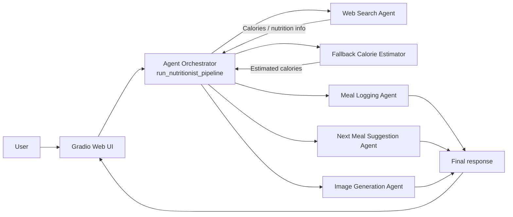

# NutriFlow Agent

NutriFlow Agent is an AI-powered nutrition assistant that helps users analyze a meal, estimate its calories, suggest a healthier next meal, and generate a visual preview of the suggestion. The project uses an agent-based workflow powered by the Mistral API and a simple Gradio web interface.

## ✨ Key Features

- 🍽️ Meal analysis and calorie estimation
- 🧠 Agent-based reasoning with tool orchestration
- 🥗 Smart next-meal recommendations
- 🖼️ AI-generated food images
- 📱 Clean and responsive web UI

## 🏗️ Architecture Diagram

## 🔍 How the Architecture Works

1. The user enters their name, meal description, and dietary preference in the Gradio interface.
2. The orchestrator in the main pipeline receives the input and coordinates the flow.
3. A web-search-based nutrition agent tries to find calorie information first.
4. If the web search fails, the system falls back to an LLM-based calorie estimation step.
5. The meal is then logged, a healthier next meal is suggested, and an image of the suggested meal is generated.
6. All outputs are returned to the UI in a single response.

## 🤖 About the Agents and Tools

This project is built around a lightweight multi-step agent design:

- Orchestrator: coordinates the full meal-analysis pipeline.
- Web Search Agent: looks up calorie and nutrition information.
- Calorie Estimator: provides a fallback if web search is unavailable.
- Meal Logging Agent: formats a meal log response for the user.
- Next Meal Suggestion Agent: recommends a healthy follow-up meal.
- Image Generation Agent: creates a meal image and saves it locally.

## 🛠️ Tech Stack

### Frontend
- Gradio Blocks for the web UI
- Responsive layout and modern styling

### Backend / AI
- Python
- Mistral API for chat completions and agent-based tools
- Agent orchestration with tool-based execution

### Utilities
- Python-dotenv for environment management
- Requests and Pillow for supporting integrations and image handling
- Regex-based parsing for extracting calorie values from model responses

## 📁 Project Structure

- app.py: Gradio frontend and request handling
- agents.py: orchestration logic for the nutrition pipeline
- tools/: modular tool implementations for search, estimation, logging, suggestions, and image generation
- generated_images/: output directory for generated meal images

## 🚀 How to Run

1. Install dependencies:
   pip install -r requirements.txt
2. Set your Mistral API key in a .env file:
   MISTRAL_API_KEY=your_api_key_here
3. Launch the app:
   python app.py

